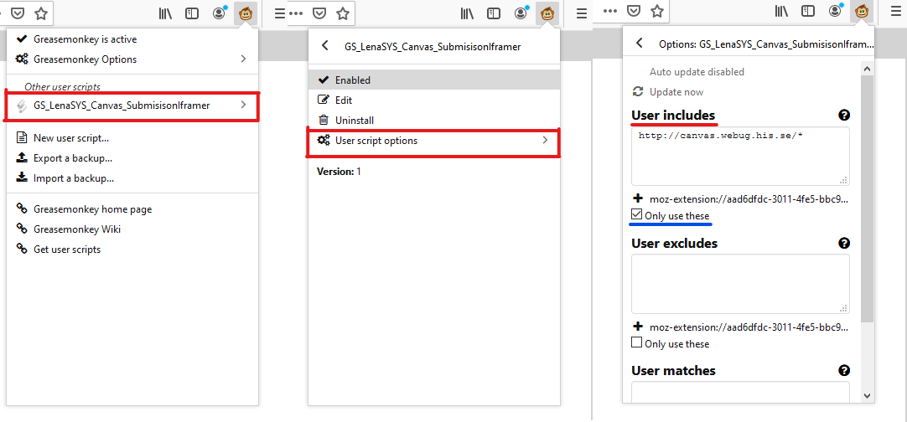

# How to install Greasemonkey extension
Requirement: Greasemonkey is firefox extension, so it can run on every platform on which firefox runs (that includes Windows, Linux, Mac, etc). So all you need is firefox. There are Greasemonkey alternative for Chrome and Opera but this guide is made for firefox.
Keep in mind that Greasemonkey is open source while unlike the chrome version of it template monkey
[ go to Greasemoneky´s website and install the plugin](https://addons.mozilla.org/en-US/firefox/addon/greasemonkey/)

# Creating a userscript
Creating your own userscript is quite easy, simply click on New user script... in the greasemonkey dropdown menu  
The script will run clientside so any changes made will be exclusive to your browser, this means that you are free to experiment, you won't be nuking anyone else's webpage.  
Make sure to include the website that you wish the script to run on, as of writing this is done through the following process:   
 
You can simply write javascript as you would usually, the DOM of the webpage your script is enabled on is accessible, so go wild and experiment.

# Speedgrader
The conclusion that has been reached in regards to speedgrader is that automatization of showing the submission in an iframe is impossible due to speedgrader iframing the hand-in data. Unless we can intercept or access the student submission in some other way, it seems to sourced in a file named after student id, which possibly could be accessible? 
Instead an iframe of LenaSYS could be appended to the speedgrader's left side container and the teacher would manually input the hash to get redirected to the submission. This has yet to be tested however so this implementation may not be viable.

