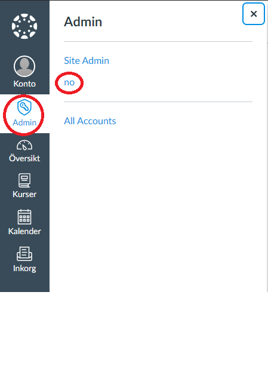
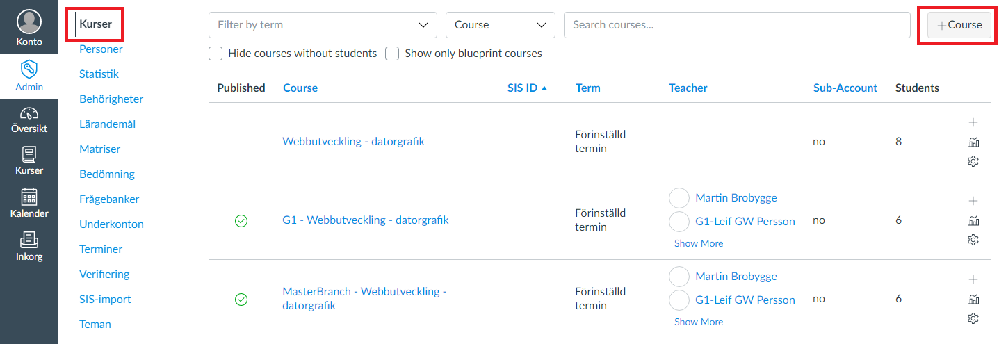
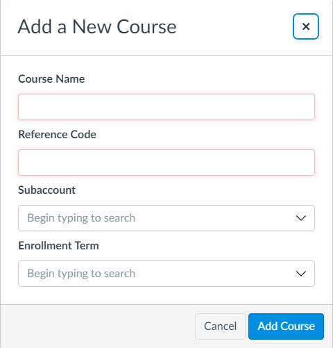
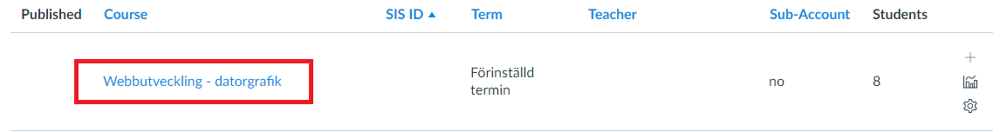
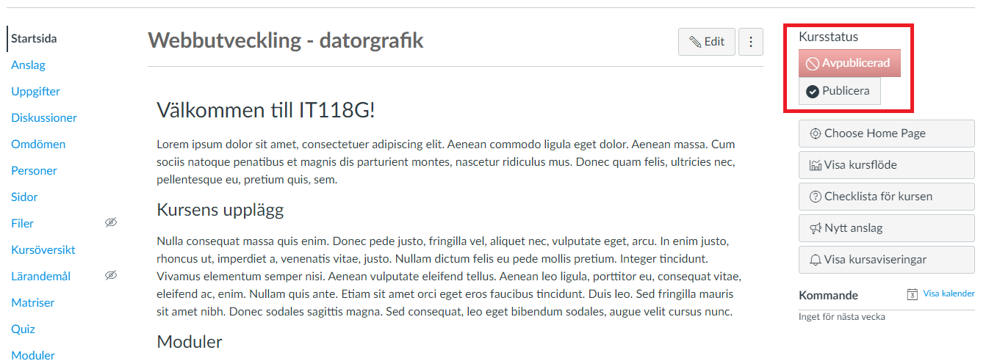
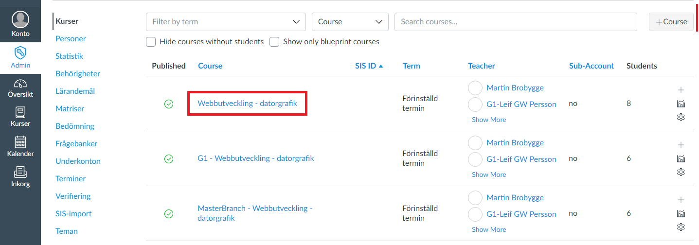
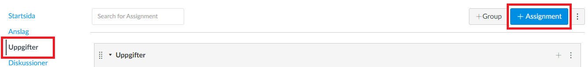
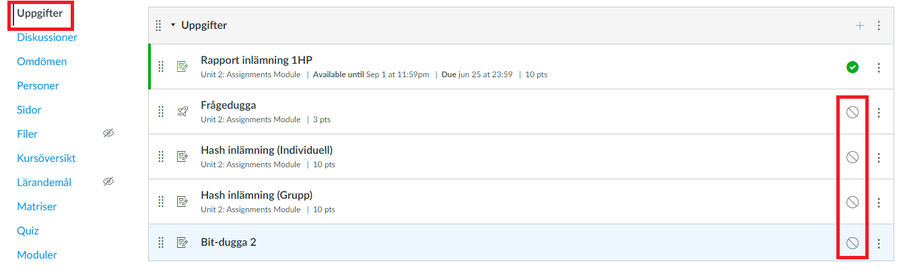

# Add course to Canvas
# (Note that you can duplicate an already existing course)

1. Log in to canvas as an administrator.  

2. Go into the admin tab to the left and then click on the "no" account. 

3. Go into the "Kurser" tab and then click on the "+Course" button to add a new course. 

4. Enter the following user information: 
**Course Name** =  Enter the name of the course (*example, Webbutveckling - datorgrafik*). 
**Reference Code** = Enter the coursecode for the course (*example, IT118G*). 
**Subaccount** = Pick the subaccount where you want the course to exist (*if you are unsure, pick "no"*). 
**Enrollment Term** = Pick the term you want for the course (*At the time this instruction is written, "Förinställd termin" is the only pick*). 
At last click the "Add Course" button. 

5. Once the course has been added, the course has to be published to be seen by students added to the course. Simply click on the coursename of your newly created course. 

6. Then click the "Publicera" button, and the course will be published. 

# Add assignment to course

1. Log in to canvas as an administrator.  

2. Go into the admin tab to the left and then click on the "no" account. 

3. Choose the course you want to add an assignment to by clicking on the coursename in the list of courses. 

4. Click on "Uppgifter" and then click the "+Assignment" button. 

5. Enter the information for the assignment that you want to create and then press the "Save" button at the bottom of the screen. If you want to publish the assignment directly click the "Save & Publish" button instead. 

6. If you want to publish the assingment at a later stage, simply click on the button marked in the picture for the corresponding assingment you want to publish. 

