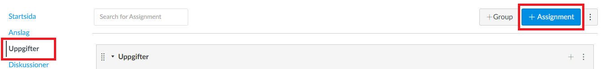
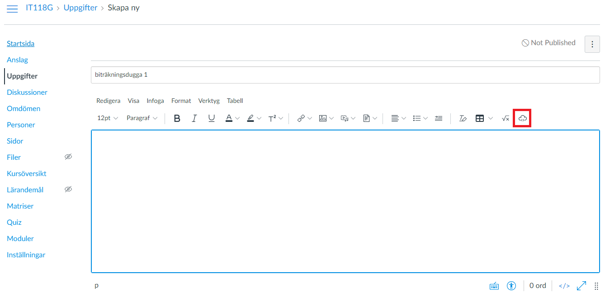
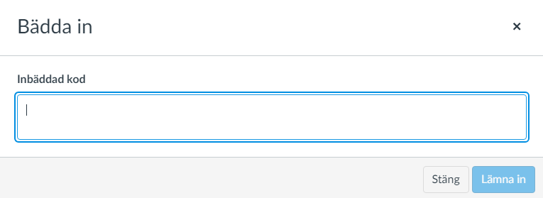

# Add LenaSYS assignment into a Canvas course assignment.

1. Go into the "Uppgifter" tab and then click on the "+Assignment" button to add a new assignment.<br/>


2. To add an iframe, click the "cloud" button (that is highlighted in the picture). <br/>


3. Enter the following code into the popup and replace the "URL HERE" with the URL of the lenasys assignment that you want to iframe.<br/>
```html
<p><iframe style="width: 100vw; height: 100vh;" src="URL HERE"></iframe></p> 
```  



4. Enter the rest of the information as you like and then click on the "Save" button. If you want to publish the assignemt, you can click on the "Save & Publish" button instead.


