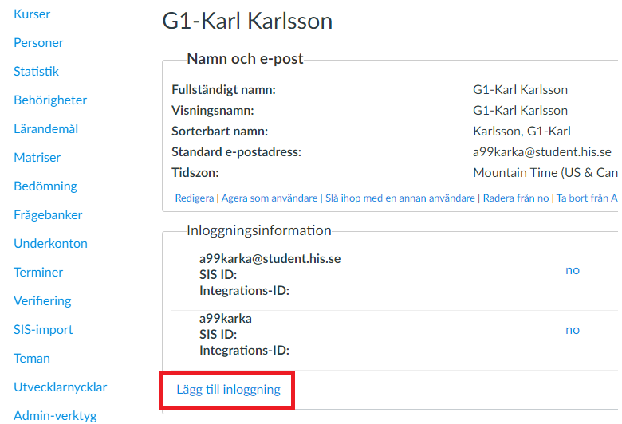
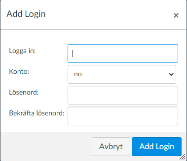

# Add user to Canvas

1. Log in to canvas as an administrator.  

2. Go into the admin tab to the left and then click on the "no" account. 

3. Go into the "Personer" tab and then click on the "+People" button to add a new user. 

4. Enter the following user information:  
**Full Name** = The users full name (*example, Karl Karlsson*).  
**Display Name** = If left empty, it will be the same as the Full Name (*example, Karl Karlsson*).  
**Sortable Name** = If left empyt, it will sort on last name (*example, Karlsson, Karl*).  
**Email** = Enter the users email (*example, a99karka@student.his.se*).  
**SIS ID** = Leave this empty.  
Then click on the "Add User" button to the bottom right. 

5. When you have added your new user you have to give that user a loginID and a password, locate it in the list of users and click it. 

6. Click the "Lägg till inloggning" button. 

7. Enter the following user information:  
**Logga in** = The username (*example, a99karka*).  
**Konto** = Leave it as is.  
**Lösenord** = Create a new password.  
**Bekräfta Lösenord** = Enter your password again to confirm.  
At last click the "Add Login" button in the bottom right of the popup-window.   

8. To add the user into a course as a teacher or student, click on the "Kurser" tab and then click on the "+" sign on the course you want to add the user to. 

9. You can add users with their Email addresses or Login ID's (*this example will use Login ID*).  
Enter the Login ID's that you want to add to the course.  
Choose the role that you want to add (*choose only Login ID's that has the same role in the box above*).  
Click the "Next" button in the bottom right. 

10. At last check that all users that you wanted to add to the course are on the list.  
Click on the "Add Users" button to confirm and add all the users to the course. 
