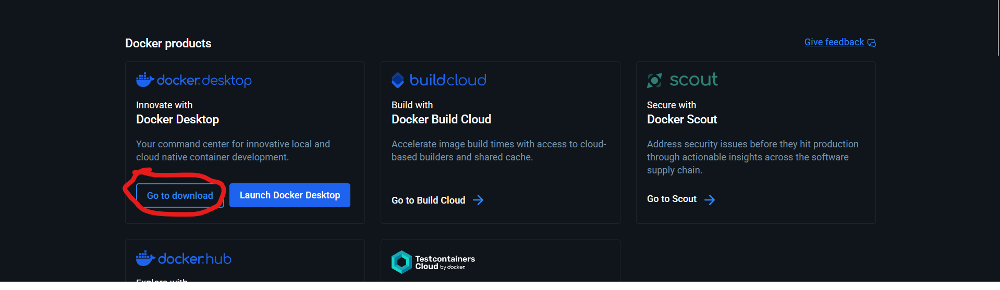
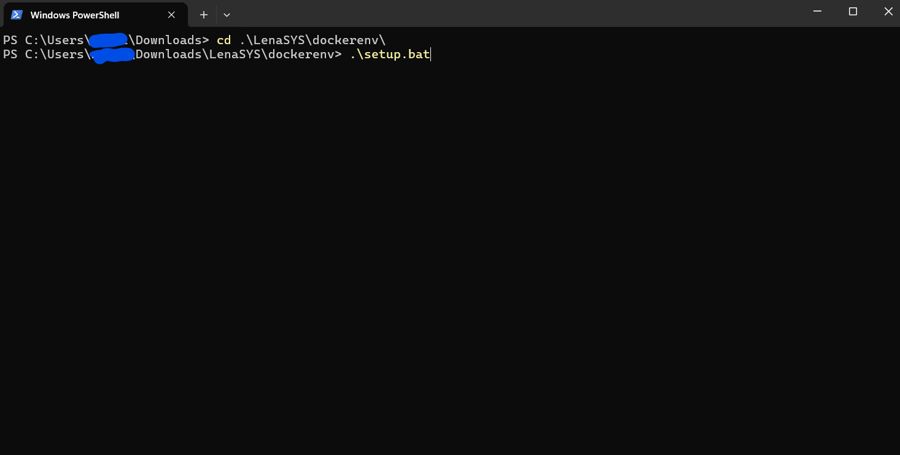
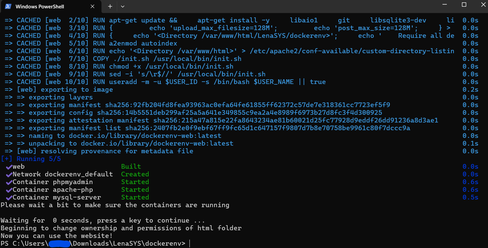
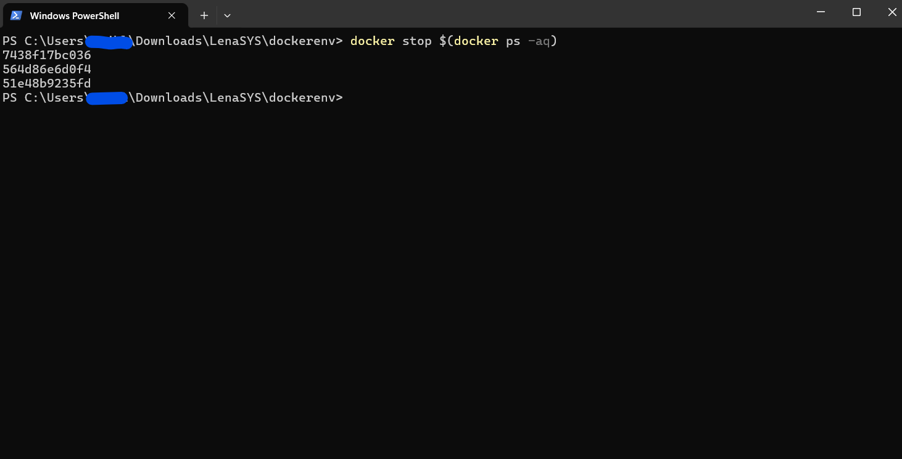
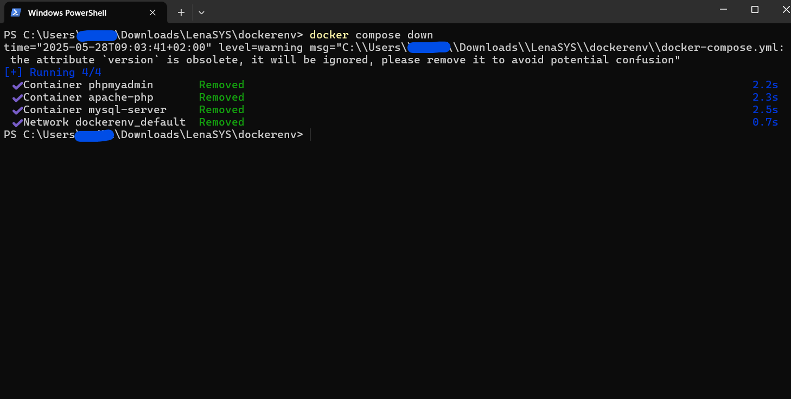

LenaSYS
==============

University of Skövde Code Viewer and Course Organization System

# Install Instructions

To install LenaSYS on your computer, you first need to install XAMPP or Docker.

## How to Install Docker

### Docker installation instructions

1. Press this link: [docker desktop](https://www.docker.com/products/docker-desktop/).

2. In the Docker website press `Choose plan`-button.


3. Choose Docker Personal.


4. Press `Continue with GitHub`-button.


5. Sign in with your school-email and password.


6. Now you are in Docker Home and press the `Go to download`-button. 


7. Select which operating software (OS) that you are using.


8. When you have selected OS and installed the installer according to your OS, follow the installer and then open a Docker desktop program/app.

9. Congratulations, you have installed the Docker desktop! If account doesn't appear in Docker desktop, then sign in your GitHub account.


### Run containers in Docker
When you have installed your Docker desktop, you can run Docker containers, but first you need to get a LenaSYS repository.

1. Open your terminal which can be bash, powershell or command. You can also use vscode terminal. 

2. When you have opened the terminal, change directory to where you want the LenaSYS repository. To do that you need to type `cd path/to/folder`. When using Windows I typed: `cd  .\Downloads\`  if you use a different OS then type: `cd <foldername>\`. 


3. When you have chosen a folder, type this command: `git clone https://github.com/HGustavs/LenaSYS.git` and wait for the download to finish. When done you will have the LenaSYS repository.


4. Now you have the LenaSYS repository, so you need to access the new directory in the terminal by typing: `cd LenaSYS/dockerenv/`.


5. Now you need to choose which script to run based on your operating system. The scripts are located at: `LenaSYS/dockerenv/`
- **On Windows:** Here you need to build a few images and containers, and to do that run the command for Windows: `.\setup.bat`. NOTE: You need to keep open Docker desktop program/app and do not turn off, otherwise this command will show an error and will not work.

- **On macOS/Linux:** There is a `setup.sh` script and run one of the following commands: `sudo ./setup.sh` or, if the the first command doesn't work, then run `sudo bash ./setup.sh`. If you can't run the script, make sure it is executable. To do so, type `sudo chmod +x setup.sh`. Then try running the script again. The `./setup.sh` script does changes file permissions and ownership for entire LenaSYS folder and builds the Docker containers. If none of them steps work, then try to follow to change the file permissions [here](#using-linux-or-mac), and then run the script again.


6. Docker has finished building images and containers when the terminal stops printing out or/and shows a blue apache-php name. NOTE: Do not close down the terminal while docker is running, otherwise containers will shutdown.


7. Now go to Docker desktop and you can see a menu which says images and containers. Press the containers from the menu and here you can see there are three containers and each one has green-circle which means they are running. If you can not see three containers, then you need to press `drop-down`-button


8. There are two ports which are apache-php and phpmyadmin server. The apache-php has a port `80:80` which can be clicked, this opens the LenaSYS website. The phpmyadmin also has a port `8080:80` which opens the phpmyadmin website. There you can manipulate sql-data, user permission and more. You need to press the `80:80` link to open the LenaSYS website.


9. In order to download LenaSYS you need to navigate to `LenaSYS/newinstaller/installer.php` this will lead you to the new installer. In case the new installer does not work for you, you can access the old installer at `LenaSYS/install/install.php`.


10. Congratulations, you can now use the LenaSYS website!


11. Before you install the LenaSYS, it is good to know that the text-input which says `Hostname`, needs to be `db`, not `localhost` and you need check/turn on `Use Distributed Environment`-checkbox. Also when entering root user credentials, type in root user: `root` and root password: `password`, because all default values is set in docker-compose-yml.

12. To install the LenaSYS, you need to follow instructions for [new LenaSYS installer](README.md/#new-installer-steps) or [old LenaSYS installer](README.md/#old-installer-steps).

#### Using linux or mac?
Make sure you set the appropriate file permissions for LenaSYS. The easiest way to do this is to run the command `sudo chmod -R 777 LenaSYS`.
After changing the file permissions recursively over the repository, all the files may show up as changes. To fix this, run `git config core.fileMode false` in the root of the repository.

### Stop containers in Docker

1. To stop running containers, open the terminal where docker is running press `ctrl-c` and wait until all three containers says stopped. NOTE: If your terminal says all three are stopped, but your username does not appear in your terminal, then press the up- or down-arrow keys to show your username.


2. If you go back to Docker desktop and go to containers, you can see three containers are not running, shown by the gray circles. Now containers are not running.


### Remove containers and images in Docker

1. If you want remove all containers, then first stop running containers which you can follow this step [stop containers in Docker](#stop-containers-in-docker).

2. After that run the command: `docker compose down` in the terminal.


3. Now your terminal says removed which means containers are removed.


4. You can check in Docker desktop and press containers. Here you can see that all containers are gone.


5. To remove all images to free up space, you need to press images in Docker desktop and select all checkboxes. When all selected,  press `Delete`-button and it will show a pop-up if you want to delete, press `Delete forever`-button. Now you have successful removed all containers and images.


### Stop running or pause Docker desktop
1. To stop running or pause Docker desktop you need to open Docker desktop press either `pause`-button to pause docker or `Quit Docker Desktop`-button to stop running docker. Now your Docker desktop is paused or stopped.


---

## How to Install XAMPP

### 1. Download and Install XAMPP
- Go to the [Apache Friends website](https://www.apachefriends.org/) and download XAMPP to your workspace.
- Once downloaded, go to your **Downloads** folder and run the installer.

**macOS Specifics**
You may receive a warning saying Apple cannot verify that XAMPP is free from malware. To fix this:
  1. Go to **Settings** -> **Privacy & Security**.
  2. Select **Open Anyway**.

### 2. XAMPP Setup Wizard
- **Select Components**: Select **XAMPP Developer Files**.
- Wait for XAMPP to install. This may take a few minutes.


### 3. Locate the XAMPP Folder
- Find the XAMPP folder on your computer.

### 4. Download LenaSYS
- Go to the [LenaSYS GitHub Repository](https://github.com/HGustavs/LenaSYS).
- Clone the repository by clicking on the green **Code** button and selecting **Download ZIP**.

### 5. Extract and Rename the Folder
- Extract the ZIP file.
- Rename the folder to **LenaSYS**.

### 6. Move LenaSYS to XAMPP's `htdocs` Folder
- Move the **LenaSYS** folder to the **htdocs** folder inside your XAMPP directory (e.g., `/XAMPP/xamppfiles/htdocs`).

### 7. Configure Apache
- The default Apache configuration is usually fine for LenaSYS.

### 8. Configure PHP
1. Open the PHP configuration file `php.ini` located at:  
   `/XAMPP/xamppfiles/etc/php.ini`
   
2. Modify the following settings:
   - Change the `upload_max_filesize` to `128M`.

3. Enable the necessary PHP drivers by uncommenting the following lines (or adding them manually if not present):
   ```ini
    extension=php_pdo.dll
    extension=php_pdo_mysql.dll
    extension=php_pdo_odbc.dll
    extension=php_pdo_sqlite.dll
   ```

**On macOS/Linux:** 
- There is a `setup.sh` script which located at: `LenaSYS/xampp/` and run one of the following commands: `sudo ./setup.sh` or, if the the first command doesn't work, then run `sudo bash ./setup.sh`. If you can't run the script, make sure it is executable. To do so, type `sudo chmod +x setup.sh`. Then try running the script again. The `./setup.sh` script does changes file permissions and ownership for entire LenaSYS folder. If none of them steps work, then try to follow to change the file permissions [here](#macos-specifics), and then run the script again.

#### macOS Specifics
- On Mac, you need to set extra permissions on the folder `xamppfiles`. 
- To do this:
  1. Right-click on the `xamppfiles` folder and select **Get Info** (or press `Cmd + I`).
  2. Under **Sharing & Permissions**, make sure to select **Read & Write** for the appropriate user (www_).

# Install LenaSYS

## New installer steps
This section contains more information about what information and what options should be provided for each page in the new installer.

### Step 1
This page is used to select your operating system. This is only used to determin wether your system uses file permissions. Both Mac OS and Linux use file permissions, meaning each file has access modifiers. For the lenasys installer to work, you need to set allow the `www-data` user access to the LenaSYS directory and its parent directory. The easiest way to do this is to run the command: `sudo chmod 777 <path to lenaSYS>` where `<>` are not part of the command. 

Due to the difference in permissions handling, this page is used to select wether or not the installer should check for permissions, and notify the user if it detects missing permissions.

### Step 2
If you are unsure about what this option means, you should most likely leave it default (both options checked).

Unchecking `Create new MySQL DB` means that the installer will not create a new database, and will instad attempt to use an already existing database. This means that the installer will fail if there is no existing database by the name later given in [step 3](#step-3).

The same principles hold true for `Create new MySQL user`. Unchecking this option means that the installer will attempt to use an existing user by the name given in [step 3](#step-3). Most of the time you do not want to disable this option. 

### Step 3 
- **Database name:** <br>
    The database name will be used to create a new database (or use an existing database if the option to create database was not set to enabled in [step 2](#step-2)), meaning that the specific value is not important and does not matter. (Unless you want to use an existing database). But you should avoid using special characters.

- **MySQL user:** <br>
    The MySQL user value will be used to either create a new user or use an existing one (depending on the option `Create new MySQL user` in [step 2](#step-2)). If you are creating a new user, its value does not matter and can be set to anything (avoid special characters). 
- **Hostname:** <br>
    The hostname is very important to set correctly or the installation will not be successful. The most common value for this option is `localhost`. But depending on your configuration and local environment it may be different. For example, if your database is located on another machine. (or on another vm / container) you will need to supply the correct IP of that machine. Since this value is used by LenaSYS to locate the database. If you are using Docker, then value for this option is `db`. 
- **MySQL user password:** <br>
    This password will not be used by you personally. It will be used to LenaSYS to connect to the database. Meaning that the value is not important, and you do not need to remember it. Its value will be stored in `../coursesyspw.php`.

- **This page also contains the options:**
    - [Use Distributed Environment](#use-distributed-environment)
    - [Verbose](#verbose)
    - [Overwrite existing database and user names](#overwrite-existing-database-and-user-names)
    
All the supplied values from this section will be stored in the file `../coursesyspw.php` which is then used by LenaSYS to establish a db connection from every page.

### Step 4
In this step you need to supply the root credentials for your database. This information will only be used once, and will not be stored. The installer asks for this information since it will otherwise not gain sufficient access to MySQL to be able to create new users, grant permissions etc. 

In most cases the default root username you should use is: `root`. And if you are using XAMPP, the default password is blank (` `), or `password` if you are using Docker.

### Step 5
This page is used to select what sample data should be included in the installation. If you are installing this as a student, you should most likely leave this default (All options enabled). This data will show up in the system when installed as various courses, users and sample files. 

This page also conatins the options: 
- [Include test-course](#include-test-course)
- [Include demo-course](#include-demo-course)
- [Inlude test-files](#include-test-files)
- [Include language support](#include-test-files)

## Options
This section covers the various options available in the installer.

### Use Distributed Environment
Enabling this option will allow the created MySQL user to connect from anywhere. The default is for the created MySQL user to only be allowed to connect from the same hostname as supplied in [step 3](#step-3). This option is useful if you have your database hosted on another machine, or you are using a containerized dev environment such as docker. 

### Verbose
The verbose mode of the installer will print alot more information, such as the individual queries it runs to install the system, and all the files it copies during installation. This is useful for debugging, but should be left off in most cases. 

### Overwrite existing database and user names
If you want to reinstall the system there is already an existing user and database. Enabling this option will first remove the database and user to ensure that a new user and database can be created. 

### Include test-course
This will include a test course.

### Include demo-course
This will include a demo course containing all existing duggas. 

### Include test-files
This option will ensure that all existing sample files will be copied over from the installer to the `courses` directory so they can be used in the system.

### Include language-support
Selecting various languages here will enable keywords from the selected languages to be used for syntax highlighing in the LenaSYS code viewer.

### Want to know more about how new installer works?
This [link](Shared/Documentation/newinstaller/documentation.md) leads to information about how the new installer works.

## Old installer steps
Make sure you have a working install of apache2 and other needed packages. Look at the wiki page for this at [Configuring web server for LenaSYS installation](https://github.com/HGustavs/LenaSYS/wiki/Configuring-web-server-for-LenaSYS-installation) for further information.

To install a fresh copy of LenaSYS on your system an installer has been created called 'install.php'.
This installer is located in the LenaSYS directory.
What the installer will do is help you create a new user in the MySQL database and a new database and fill it with some test data (if desired) to help you get started.

**1. To start the installation, put the LenaSYS directory at the place you want the system located.**

**2. When the the directory is in the right place, go to the installer from a web browser of your choosing.**

**3. Set permissions for Apache.**


* The first thing you will have to do is set permissions for Apache. Notice that this popup will only show for Linux and Mac (Darwin) based systems. No * permissions are by default needed for Windows.

**4. Database credentials used by the system**


* In the first field you will need to provide the desired username to be used in the database.
* A password for this user will be needed for identification when logging in to the database later. This will need to be filled in the next field.
* Provide the name of the database you want to use. You can use an existing database here and choose later if you want to write over it. If you dont want to write over you will need to provide a unique name.
* For hostname you will need to provide the name of the host the database is located on (standard is localhost/127.0.0.1).

## 5. Database credentials for installer


* You will need to enter the credentials for root access (to get this - ask someone that have knowledge of this information).

## 6. Database creation


* The last step is to fill the three boxes. The upper box should be checked if a new database with the provided name should be created (this will only initialize a new database for the site and create empty tables to hold information).
* If the created database should be filled with some test data (this includes some courses, users, etc.). This can be used to easily test the new installation of the system. 
* The demo-page which can be included consist of all currently available duggas.

## 7. Database overwrite


* The box should be checked if you provided an existing database or/and user and wish to overwrite this. (**WARNING! THIS WILL DESTROY ALL PREVIOUS INFORMATION IN THIS DATABASE**).

* There is also an option to run the installer as an transaction. If something goes wrong this can be unticked to find the exact SQL-query that's causing trouble.

## 8. Installation start


* When everything is filled, press 'Install!'.


## 9. Installation finished
* The installer will automatically create all you need and fill the new database with data (if this was selected). If the first rows of the installation progress are GREEN (successull messages) it means everything was successfull and you will not need to do any further investigation.
* If you get error-messages (RED) that tells you something has failed - please check what went wrong and try again. A common error is that the creation of database or user failed because they already exist in the database (and you did not check the box that writes over the existing one).
* If you get other error messages (with weird exceptions and such) this will probably mean that connection failed (the hostname is incorrect or unavailable) or the root credentials were wrong. Please look this information up and try again;

## 10. The installer will, after successful creation of database, tell you what to do next.


**The installation should now be completed and the website should be linked to the database.**
#### CONGRATULATIONS!

## 11. Handling possible remaining errors
If LenaSYS is still not functional, possible errors may be found in \apache2\logs. It is very possible that the installer promts you to change upload_max_filesize in ini.php. Make sure that the webserver is restarted after any changes to php.ini. Another issue commonly encountered is ": PHP Fatal error: Uncaught PDOException:could not find driver...". To solve this, enbale the following drivers in the ini.php file by uncommenting them: php_pdo.dll, php_pdo_mysql.dll, php_pdo_odbc.dll and php_pdo_sqlite.dll.

## To get ZIP-ARCHIVE to work(used in download zip function)
* If the zip function to work your server needs to have to zip plugin installed and activated.
  on linux you need to do:
  sudo apt-get install php7.2-zip (if the server is running a different php install the right version or ZIP-ARCHIVE)
  sudo /etc/init.d/apache2 restart

* for windows: should be built in to php. please google ZIP-ARCHIVE if it still don't work.

* The you need to give the LenaSYS directory enough permissions to read and write for this you can do "chmod -R 777 *folder*" 

# Push notifications installation

**Note:** For the push notification system to work the server needs to use https, so make sure that is set up and valid.

To set up https, look at the guide on this wiki page: [Getting a free ssl certificate and installing it when not having access to port 80](https://github.com/HGustavs/LenaSYS/wiki/Getting-a-free-ssl-certificate-and-installing-it-when-not-having-access-to-port-80)

**Note:** Only install if there is no other push notifications installation on the system already, if an installation already exists follow the guide further below for instructions for that.

1. To install the push notification subsystem first the following packages needs to be installed. The following commands assume the system is using php version 7.0. If you use another version, change all the 7.0 in the command below to the php version on your system and run the following command:

```BASH
sudo apt-get install php7.0-curl php7.0-gmp php7.0-mbstring
```

2. Install composer in your LenaSYS folder ( https://getcomposer.org/ )

3. Go into the LenaSYS folder run the following command. This command will download all the packages listed in the 'composer.json' file and download them to the 'vendor/' folder.

```BASH
php composer.phar install
```

4. Now open the 'coursesyspw.php' file created earlier during the initial installation of LenaSYS. The following settings need to be added in the bottom part of the file:

```PHP
define("PUSH_NOTIFICATIONS_VAPID_PUBLIC_KEY", "Insert your public key here");
define("PUSH_NOTIFICATIONS_VAPID_PRIVATE_KEY", "Insert your private key here");
define("PUSH_NOTIFICATIONS_VAPID_EMAIL", "Insert your email address here");
```

If you do not have a private and public key already, you can use the tool at /DuggaSys/pushnotifications.php?action=genkeys to generate keys locally for usage. You need to be logged in as an administrator in LenaSys to use the tool. These keys should be shared to every installation on the same server.


## Copying a push notifications installation if it was already installed before

If another installation of LenaSys has push notification installed it is much simpler to copy that.

1. Find another installation of LenaSys with push notifications installed. In the following steps we will assume an installation exists at /[groupname]/[username]/LenaSYS

2. Copy the folder vendor/ from /[groupname]/[username]/LenaSYS to /[groupname]/[**YOUR**username]/LenaSYS

3. Open the file /[groupname]/[username]/coursesyspw.php and locate the rows containing code like this

```PHP
define("PUSH_NOTIFICATIONS_VAPID_PUBLIC_KEY", "Insert your public key here");
define("PUSH_NOTIFICATIONS_VAPID_PRIVATE_KEY", "Insert your private key here");
define("PUSH_NOTIFICATIONS_VAPID_EMAIL", "Insert your email address here");
```

4. Copy that code from that file into /[groupname]/[**YOUR**username]/LenaSYS/coursesyspw.php
