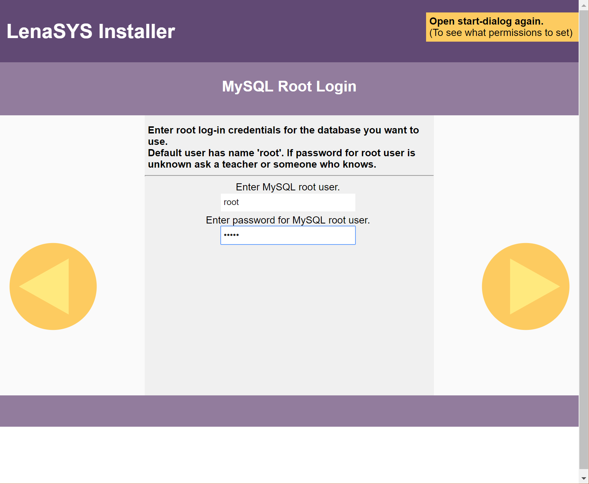
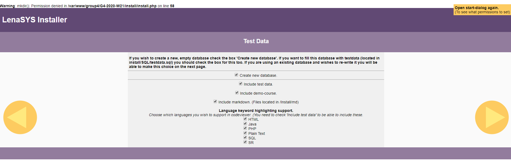
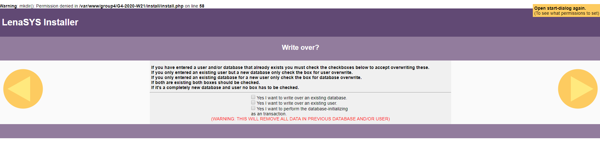
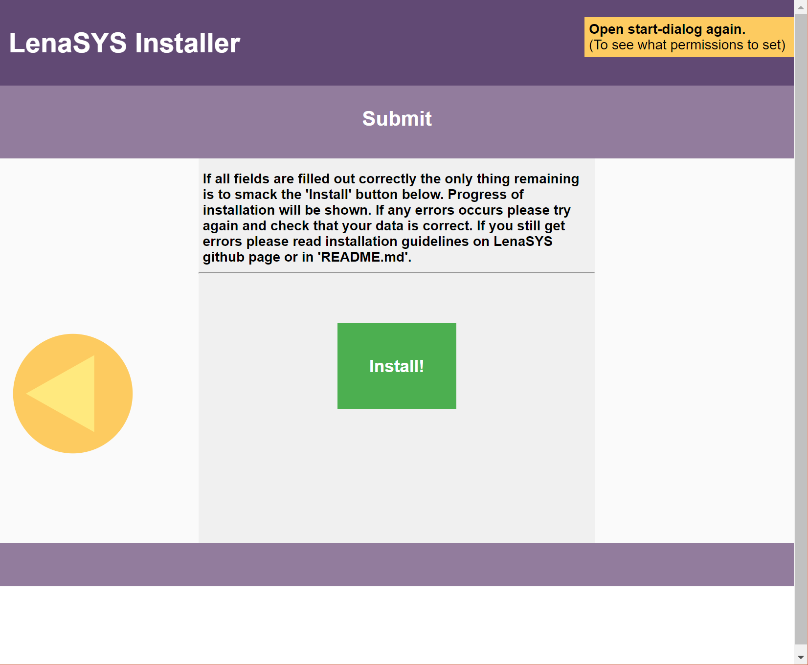

LenaSYS
==============

University of Skövde Code Viewer and Course Organization System

# Install Instructions

Make sure you have a working install of apache2 and other needed packages. Look at the wiki page for this at [Configuring web server for LenaSYS installation](https://github.com/HGustavs/LenaSYS/wiki/Configuring-web-server-for-LenaSYS-installation) for further information.

To install a fresh copy of LenaSYS on your system an installer has been created called 'install.php'.
This installer is located in the LenaSYS directory.
What the installer will do is help you create a new user in the MySQL database and a new database and fill it with some test data (if desired) to help you get started.

**1. To start the installation, put the LenaSYS directory at the place you want the system located.**

**2. When the the directory is in the right place, go to the installer from a web browser of your choosing.**

**3. Set permissions for Apache.**


* The first thing you will have to do is set permissions for Apache. Notice that this popup will only show for Linux and Mac (Darwin) based systems. No * permissions are by default needed for Windows.

**3. Database credentials used by the system**


* In the first field you will need to provide the desired username to be used in the database.
* A password for this user will be needed for identification when logging in to the database later. This will need to be filled in the next field.
* Provide the name of the database you want to use. You can use an existing database here and choose later if you want to write over it. If you dont want to write over you will need to provide a unique name.
* For hostname you will need to provide the name of the host the database is located on (standard is localhost).

## 4. Database credentials for installer


* You will need to enter the credentials for root access (to get this - ask someone that have knowledge of this information).

## 5. Database creation


* The last step is to fill the three boxes. The upper box should be checked if a new database with the provided name should be created (this will only initialize a new database for the site and create empty tables to hold information).
* If the created database should be filled with some test data (this includes some courses, users, etc.). This can be used to easily test the new installation of the system. The demo-page which can be included consist of all currently available duggas.

## 6. Database overwrite


* The box should be checked if you provided an existing database or/and user and wish to overwrite this. (**WARNING! THIS WILL DESTROY ALL PREVIOUS INFORMATION IN THIS DATABASE**).

* There is also an option to run the installer as an transaction. If something goes wrong this can be unticked to find the exact SQL-query that's causing trouble.

## 7. Installation start


* When everything is filled, press 'Install!'.


## 8. Installation finished
* The installer will automatically create all you need and fill the new database with data (if this was selected). If the first rows of the installation progress are GREEN (successull messages) it means everything was successfull and you will not need to do any further investigation.
* If you get error-messages (RED) that tells you something has failed - please check what went wrong and try again. A common error is that the creation of database or user failed because they already exist in the database (and you did not check the box that writes over the existing one).
* If you get other error messages (with weird exceptions and such) this will probably mean that connection failed (the hostname is incorrect or unavailable) or the root credentials were wrong. Please look this information up and try again;

## 9. The installer will, after successful creation of database, tell you what to do next.


**The installation should now be completed and the website should be linked to the database.**
#### CONGRATULATIONS!

## 10. Handling possible remaining errors
If LenaSYS is still not functional, possible errors may be found in \apache2\logs. It is very possible that the installer promts you to change upload_max_filesize in ini.php. Make sure that the webserver is restarted after any changes to php.ini. Another issue commonly encountered is ": PHP Fatal error: Uncaught PDOException:could not find driver...". To solve this, enbale the following drivers in the ini.php file by uncommenting them: php_pdo.dll, php_pdo_mysql.dll, php_pdo_odbc.dll and php_pdo_sqlite.dll.

## To get ZIP-ARCHIVE to work(used in download zip function)
* If the zip function to work your server needs to have to zip plugin installed and activated.
  on linux you need to do:
  sudo apt-get install php7.2-zip (if the server is running a different php install the right version or ZIP-ARCHIVE)
  sudo /etc/init.d/apache2 restart

* for windows: should be built in to php. please google ZIP-ARCHIVE if it still don't work.

* The you need to give the LenaSYS directory enough permissions to read and write for this you can do "chmod -R 777 *folder*" 

# Push notifications installation

**Note:** For the push notification system to work the server needs to use https, so make sure that is set up and valid.

To set up https, look at the guide on this wiki page: [Getting a free ssl certificate and installing it when not having access to port 80](https://github.com/HGustavs/LenaSYS/wiki/Getting-a-free-ssl-certificate-and-installing-it-when-not-having-access-to-port-80)

**Note:** Only install if there is no other push notifications installation on the system already, if an installation already exists follow the guide further below for instructions for that.

1. To install the push notification subsystem first the following packages needs to be installed. The following commands assume the system is using php version 7.0. If you use another version, change all the 7.0 in the command below to the php version on your system and run the following command:

```BASH
sudo apt-get install php7.0-curl php7.0-gmp php7.0-mbstring
```

2. Install composer in your LenaSYS folder ( https://getcomposer.org/ )

3. Go into the LenaSYS folder run the following command. This command will download all the packages listed in the 'composer.json' file and download them to the 'vendor/' folder.

```BASH
php composer.phar install
```

4. Now open the 'coursesyspw.php' file created earlier during the initial installation of LenaSYS. The following settings need to be added in the bottom part of the file:

```PHP
define("PUSH_NOTIFICATIONS_VAPID_PUBLIC_KEY", "Insert your public key here");
define("PUSH_NOTIFICATIONS_VAPID_PRIVATE_KEY", "Insert your private key here");
define("PUSH_NOTIFICATIONS_VAPID_EMAIL", "Insert your email address here");
```

If you do not have a private and public key already, you can use the tool at /DuggaSys/pushnotifications.php?action=genkeys to generate keys locally for usage. You need to be logged in as an administrator in LenaSys to use the tool. These keys should be shared to every installation on the same server.


## Copying a push notifications installation if it was already installed before

If another installation of LenaSys has push notification installed it is much simpler to copy that.

1. Find another installation of LenaSys with push notifications installed. In the following steps we will assume an installation exists at /[groupname]/[username]/LenaSYS

2. Copy the folder vendor/ from /[groupname]/[username]/LenaSYS to /[groupname]/[**YOUR**username]/LenaSYS

3. Open the file /[groupname]/[username]/coursesyspw.php and locate the rows containing code like this

```PHP
define("PUSH_NOTIFICATIONS_VAPID_PUBLIC_KEY", "Insert your public key here");
define("PUSH_NOTIFICATIONS_VAPID_PRIVATE_KEY", "Insert your private key here");
define("PUSH_NOTIFICATIONS_VAPID_EMAIL", "Insert your email address here");
```

4. Copy that code from that file into /[groupname]/[**YOUR**username]/LenaSYS/coursesyspw.php
