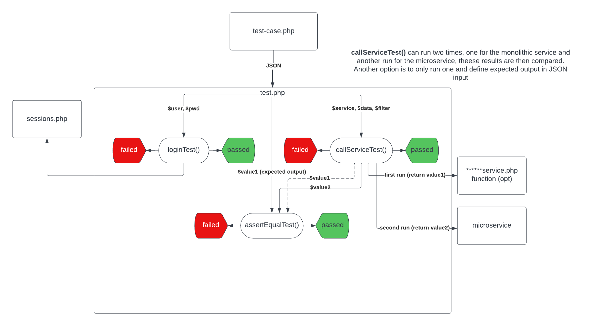

# Guide on how to use Test API 

The test API makes it possible to test multiple services in a monolithic or a microservice and compare the result of the execution to determine if a microservice is working like the monolithic service or not, alternatively compare the result to an expected output. And it can also be used to automate a service execution without manually doing the actions required. 



**Figure 1**  Overview of the processes performed by the Test API 


### How it works 

The test API executes three different tests, the first one making sure that the login credentials work, the second one calling the actual service with the service data, and the last test compares the result. The result that is to be compared can either be the results from the monolithic service and the microservice, or the value of a service execution and an expected value from the JSON input data. All these three tests will output a pass or fail for each test as well as the response. 

### How to use it 

The test API aims to be as easy as possible. In figure 2 you can find an example of the code and JSON needed to use the test API, this will be referred to in this guide. First you need to include the test.php file. And the last step in the code should be to call the testHandler() with the JSON data and the second parameter that decides how you want to view the results. The JSON data in $testsData is what controls the testing API. For every outer array you include in this JSON a test will be run for the service, in the example there are currently two tests: create course test and create course test 2.  

- **expected-output:** Data to use in the comparison test. Compares this data to the service output. You will need to find this from the respons when manually do the actions required to execute a service.
- **query-before-test:** If database query is needed before test (ex insert) insert query here.
- **query-after-test:** If database query is needed after test (ex delete) insert query here. 
- **service:** This should be the URL to the file that contains the service you are going to test. 
- **service-data**: Include here all data that are needed to execute the specific service. The monolithic services use the opt to decide which service to execute. But each service also needs other parameters to be able to execute the service. In the example all parameters to create a new course is defined. This is something you need to find out, and there should be test descriptions on GitHub that describes all these needed parameters. 

- **filter-option:** This decides what JSON output to use in the comparison test that will be performed later. This should be the same as the expected output if used. And it is also the displayed repones from the test. If none is used as the only value in the array all output data from the service will be used.  

```php
/*
----------------------------------------------------------
    Example on how to run this test from another file:
----------------------------------------------------------
*/
 
<?php
 
include "../Shared/test.php";
 
$testsData = array(
    'create course test' => array(
        'expected-output' => '{"debug":"NONE!","motd":"UNK"}',
        'query-before-test' => "INSERT INTO course (coursecode,coursename,visibility,creator, hp) VALUES('IT401G','MyAPICourse',0,101, 7.5)",
        'query-after-test' => "DELETE FROM course WHERE coursecode = 'IT478G' AND coursename = 'APICreateCourseTestQuery'",
        'service' => 'https://cms.webug.se/root/G2/students/c21alest/LenaSYS/DuggaSys/courseedservice.php',
        'service-data' => serialize(array( // Data that service needs to execute function
            'opt' => 'NEW',
            'username' => 'usr',
            'password' => 'pass',
            'coursecode' => 'IT466G',
            'coursename' => 'TestCourseFromAPI4',
            'uid' => '101'
        )),
        'filter-output' => serialize(array( // Filter what output to use in assert test, use none to use all ouput from service
            'debug',
            'readonly'
        )),
    ),
    'create course test 2' => array(
        'expected-output' => '{"debug":"NONE!","motd":"UNK"}',
        'service' => 'https://cms.webug.se/root/G2/students/c21alest/LenaSYS/DuggaSys/courseedservice.php',
        'service-data' => serialize(array( // Data that service needs to execute function
            'opt' => 'NEW',
            'username' => 'usr',
            'password' => 'pass',
            'coursecode' => 'IT466G',
            'coursename' => 'TestCourseFromAPI5',
            'uid' => '101'
        )),
        'filter-output' => serialize(array( // Filter what output to use in assert test, use none to use all ouput from service
            'none'
        )),
    ),
);
 
testHandler($testsData, false); // 2nd argument (prettyPrint): true = prettyprint (HTML), false = raw JSON

```

**Figure 2**  Example of test case code 


### JSON Output and pretty print 

Depending on the second argument to testHandler two different outputs will be displayed.  

- **True:** Returns HTML that displays the results.  
- **False:** Returns all test results as JSON. 

***Guide for Test API version 1.1***