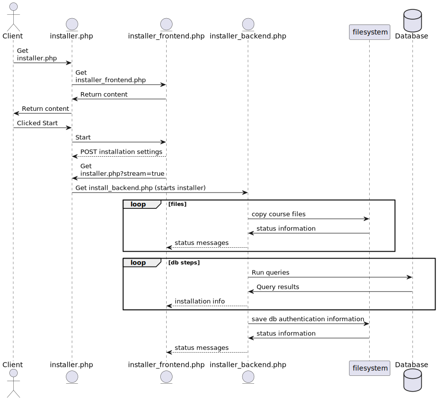

# New Installer

## Usage
1. Navigate to [localhost/LenaSYS/newinstaller/installer.php](http://localhost/LenaSYS/newinstaller/installer.php).
    - Note that you need a working development environment to be able to navigate to this link. Installation guide can be found [here]().
2. Select your platform.
    - If your platform uses file permissions (Mac OS or Linux), this option will ensure that you are given proper information about these.
3. Choose database credentials.
    - This data will be used to create a new MySQL user.
    - The hostname will be used to connect to the database. In most instances this should be set to `localhost`.
4. Enter root user credentials.
    - In order for the installer to create a database, user and set permissions, root user credentials are needed. 
    - If you are using [xampp](https://www.apachefriends.org/) you can retrieve them like [this](https://community.apachefriends.org/f/viewtopic.php?t=72519).
5. Select the test data you wish to install.
    - If you are intending to use this as a dev environment, leave it default. 


## Goals

The new installer of LenaSYS aims to solve some of the problems with the previous one, such as:

- Unhelpful error messages.
- Various UI problems.
- Missing error handling when accessing local file system.
- No separation of concerns, everything is handled by one file.

## Architecture
The installer is built using a separate front end and backend. With the entrypoint `installer.php` acting as a router serving the user the frontend, but also allowing the frontend to request a stream of the installation output from the backend. 

Here is a sequence diagram of how the new installer works. (dotted arrows denote a message (or flow of information) that does not change the executing lifeline.)



To handle output from the installer backend, a static class define in `LenaSYS/newinstaller/tools/sse_receiver.php` was created, which contains a function `transmit()` that automatically handles output.

All subsequent installer functions should then be supplied with this function as a callback, to properly send data to the frontend using [SSE](https://developer.mozilla.org/en-US/docs/Web/API/Server-sent_events/Using_server-sent_events).

## Settings format
The following json settings format is used to supply the installer with the proper settings. 
```json
{
    verbose: 'false',
    create_db: 'true',
    create_db_user: 'true',
    overwrite_db: 'true', 
    overwrite_user: 'true',
    add_test_data: 'true',
    add_demo_course: 'true',
    add_test_course_data: 'true',
    add_test_files: "true",
    language_support: ["html", "java", "php", "plain", "sql", "sr"],
    starting_step: "",
    username: "Lena",
    password: "Syp9393",
    hostname: "db",
    distributed_environment: "true",
    db_name: "LenaDB",
    root_username: "root",
    root_password: "password",
}
```

- Verbose is used to print extra information if needed for debugging.
- add_test_data adds `testdata.sql` to installation queue.
- add_demo_course adds `demoCourseData.sql` to installation queue.
- add_test_course_data adds `testingCourseData.sql` to installation queue.
- add_test_files copies the course files from the installer to the courses directory.
- starting_step allows the installer to skip previous installation steps. Can be used to restart the installer from step n.

> **Note:** Since SSE does not support sending post requests, the installation settings are sent beforehand to `installer.php` and stored in the session. The session data is then sent as function parameters to the installer backend. 

## Installation steps
*The steps performed by the installer (Some of these are optional and will only be installed if they are enabled).*
- Open output buffer.
- Declade pdo instance that connects to database.
- Build an "Installation queue" `$operations`, that contains all the following steps. 
    - Open configuration file `coursesyspw.php`
    - Create new MySQL user. (can be forced to overwrite existing user)
    - Create new Database. (can be forced to overwrite existing database)
    - Grant access for user to created database.
    - Run `init_db.sql` script that defines the db schema.
    - Write configuration file `coursesyspw.php`. (Do this after executing first SQL file to ensure that the supplied credenitals are valid).
    - Execute sql language file(s) eg `keywords_css.sql`.
    - Copy course files from installer to courses directory.
    - Execute `testdata.sql`
    - Execute `demoCourseData.sql`
    - Execute `testingCourseData.sql`

- Execute installation queue.
- Close output buffer.

## Tools
*The installer contains various help tools that helps organize the installation steps. Here are some of the classes*
- `tools/db_setup.php`
    <br> Contains functions for creating users, databases, granting user permissions, and executing sql files. 
    
- `tools/install_engine.php`
    <br> This file has been commonly reffered to as the installer backend in this document as it is used to run all of the installation steps. 

- `tools/permissions.php`
    <br> This file can be used to retrieve file permissions. example usage:
    ```php
    $permissions = Permissions::get_permissions("path")['success'] 
    ? Permissions::get_permissions("path")['data']['permissions'] : Permissions::get_permissions("path")['message'];
    ```
    This retrieves the file permissions if they are available, otherwise it returns an approriate message displaying why they could not be retreived.

- `tools/sse_sender.php`
    <br> This file is used to open the SSE stream that the frontend counterpart `sse_receiver.js` listens to by handling the output buffer and other relevant settings. 

- `tools/sse_receiver.js`
    <br> Used to listen to sse stream.

- `tools/testdata_setup.php`
    <br> Used to copy course files from a source to a destination. Automatically handles file permissions and recursive copying of directories.

<br><br>

# Installer steps
This section contains more information about what information and what options should be provided for each page in the new installer.

## Step 1
This page is used to select your operating system. This is only used to determin wether your system uses file permissions. Both Mac OS and Linux use file permissions, meaning each file has access modifiers. For the lenasys installer to work, you need to set allow the `www-data` user access to the LenaSYS directory and its parent directory. The easiest way to do this is to run the command: `sudo chmod 777 <path to lenaSYS>` where `<>` are not part of the command. 

Due to the difference in permissions handling, this page is used to select wether or not the installer should check for permissions, and notify the user if it detects missing permissions.

## Step 2
If you are unsure about what this option means, you should most likely leave it default (both options checked).

Unchecking `Create new MySQL DB` means that the installer will not create a new database, and will instad attempt to use an already existing database. This means that the installer will fail if there is no existing database by the name later given in [step 3](#step-3).

The same principles hold true for `Create new MySQL user`. Unchecking this option means that the installer will attempt to use an existing user by the name given in [step 3](#step-3). Most of the time you do not want to disable this option. 

## Step 3 
- Database name: <br>
    The database name will be used to create a new database (or use an existing database if the option to create database was not set to enabled in [step 2](#step-2)), meaning that the specific value is not important and does not matter. (Unless you want to use an existing database). But you should avoid using special characters.

- **MySQL user:** <br>
    The MySQL user value will be used to either create a new user or use an existing one (depending on the option `Create new MySQL user` in [step 2](#step-2)). If you are creating a new user, its value does not matter and can be set to anything (avoid special characters). 
- **Hostname:** <br>
    The hostname is very important to set correctly or the installation will not be successful. The most common value for this option is `localhost`. But depending on your configuration and local environment it may be different. For example, if your database is located on another machine. (or on another vm / container) you will need to supply the correct IP of that machine. Since this value is used by LenaSYS to locate the database.
- **MySQL user password:** <br>
    This password will not be used by you personally. It will be used to LenaSYS to connect to the database. Meaning that the value is not important, and you do not need to remember it. Its value will be stored in `../coursesyspw.php`.

- **This page also contains the options:**
    - [Use Distributed Environment](#use-distributed-environment)
    - [Verbose](#verbose)
    - [Overwrite existing database and user names](#overwrite-existing-database-and-user-names)
    
All the supplied values from this section will be stored in the file `../coursesyspw.php` which is then used by LenaSYS to establish a db connection from every page.

## Step 4
In this step you need to supply the root credentials for your database. This information will only be used once, and will not be stored. The installer asks for this information since it will otherwise not gain sufficient access to MySQL to be able to create new users, grant permissions etc. 

In most cases the default root username you should use is: `root`. And if you are using XAMPP, the default password is blank (` `).

## Step 5
This page is used to select what sample data should be included in the installation. If you are installing this as a student, you should most likely leave this default (All options enabled). This data will show up in the system when installed as various courses, users and sample files. 

This page also conatins the options: 
- [Include test-course](#include-test-course)
- [Include demo-course](#include-demo-course)
- [Inlude test-files](#include-test-files)
- [Include language support](#include-test-files)

# Options
This section covers the various options available in the installer.

## Step 6 - SSL

To enable https on your system you need SSL on the apache server you are hosting lenasys with.

### Tutorials
If you are using [XAMPP](ssl-xampp.md)

## Use Distributed Environment
Enabling this option will allow the created MySQL user to connect from anywhere. The default is for the created MySQL user t
o only be allowed to connect from the same hostname as supplied in [step 3](#step-3). This option is useful if you have your database hosted on another machine, or you are using a containerized dev environment such as docker. 

## Verbose
The verbose mode of the installer will print alot more information, such as the individual queries it runs to install the system, and all the files it copies during installation. This is useful for debugging, but should be left off in most cases. 

## Overwrite existing database and user names
If you want to reinstall the system there is already an existing user and database. Enabling this option will first remove the database and user to ensure that a new user and database can be created. 

## Include test-course
This will include a test course.

## Include demo-course
This will include a demo course containing all existing duggas. 

## Include test-files
This option will ensure that all existing sample files will be copied over from the installer to the `courses` directory so they can be used in the system.

## Include language-support
Selecting various languages here will enable keywords from the selected languages to be used for syntax highlighing in the LenaSYS code viewer. 

