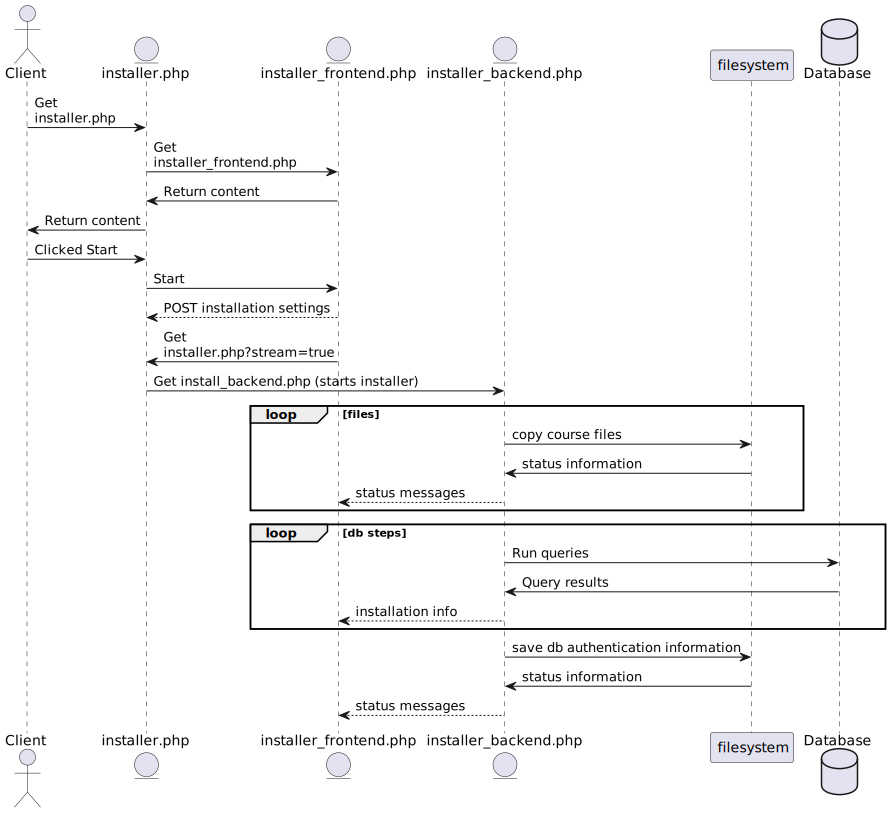

# New Installer

## Usage
1. Navigate to [localhost/LenaSYS/newinstaller/installer.php](http://localhost/LenaSYS/newinstaller/installer.php).
    - Note that you need a working development environment to be able to navigate to this link. Installation guide can be found [here]().
2. Select your platform.
    - If your platform uses file permissions, this option will ensure that you are given proper information about these.
3. Choose database credentials.
    - This data will be used to create a new MySQL user.
    - The hostname will be used to connect to the database. In most instances this should be set to `localhost`.
4. Enter root user credentials.
    - In order for the installer to create a database, user and set permissions, root user credentials are needed. 
    - If you are using [xampp]() you can retrieve them like [this]().
5. Select the test data you wish to install.
    - If you are intending this as a dev environment, leave it default. 

## Goals

The new installer of LenaSYS aims to solve some of the problems with the previous one, such as:

- Unhelpful error messages.
- Various UI problems.
- Missing error handling when accessing local file system.
- No separation of concerns, everything is handled by one file.

## Architecture
The installer is built using a separate front end and backend. With the entrypoint `installer.php` acting as a router serving the user the frontend, but also allowing the frontend to request a stream of the installation output from the backend. 

Here is a sequence diagram of how the new installer works. (dotted arrows denote a message (or flow of information) that does not change the executing lifeline.)



To handle output from the installer backend, a static class define in `LenaSYS/newinstaller/tools/sse_receiver.php` was created, which contains a function `transmit()` that automatically handles output.

All subsequent installer functions should then be supplied with this function as a callback, to properly send data to the frontend using [SSE](https://developer.mozilla.org/en-US/docs/Web/API/Server-sent_events/Using_server-sent_events).

## Settings format
The following json settings format is used to supply the installer with the proper settings. 
```json
{
    verbose: 'false',
    overwrite_db: 'true', 
    overwrite_user: 'true',
    add_test_data: 'true',
    add_demo_course: 'true',
    add_test_course_data: 'true',
    add_test_files: "true", 
    language_support: ["html", "java", "php", "plain", "sql", "sr"],
    starting_step: "",
    username: "Lena",
    password: "Syp9393",
    hostname: "localhost",
    db_name: "LenaDB",
    root_user: "root",
    root_password: "Syp9393",
}
```

- Verbose is used to print extra information if needed for debugging.
- add_test_data adds `testdata.sql` to installation queue.
- add_demo_course adds `demoCourseData.sql` to installation queue.
- add_test_course_data adds `testingCourseData.sql` to installation queue.
- add_test_files copies the course files from the installer to the courses directory.
- starting_step allows the installer to skip previous installation steps. Can be used to restart the installer from step n.

> **Note:** Since SSE does not support sending post request, the installation settings are sent beforehand to `installer.php` and stored in the session. The session data is then sent as function parameters to the installer backend. 

## Installation steps
*The steps performed by the installer (Some of these are optional and will only be installed if they are enabled).*
- open output buffer.
- Declade pdo instance that connects to database.
- Build an "Installation queue" `$operations`, that contains all the following steps. 
    - Open configuration file `coursesyspw.php`
    - Create new MySQL user. (can be forced to overwrite existing user)
    - Create new Database. (can be forced to overwrite existing database)
    - Grant access for user to created database.
    - Run `init_db.sql` script that defines the db schema.
    - Write configuration file `coursesyspw.php`. (Do this after executing first SQL file to ensure that the supplied credenitals are valid).
    - Execute sql language file(s) eg `keywords_css.sql`.
    - Copy course files from installer to courses directory.
    - Execute `testdata.sql`
    - Execute `demoCourseData.sql`
    - Execute `testingCourseData.sql`

- Execute installation queue.
- Close output buffer.

## Tools
*The installer contains various help tools that helps organize the installation steps. Here are some of the classes*
- `tools/db_setup.php`
    <br>contains functions for creating users, databases, granting user permissions, and executing sql files. 
    
- `tools/install_engine.php`
    <br> This file has been commonly reffered to as the installer backend in this document as it is used to run all of the installation steps. 

- `tools/permissions.php`
    <br> This file can be used to retrieve file permissions. example usage:
    ```php
    $permissions = Permissions::get_permissions("path")['success'] 
    ? Permissions::get_permissions("path")['data']['permissions'] : Permissions::get_permissions("path")['message'];
    ```
    This retrieves the file permissions if they are available, otherwise it returns an approriate message displaying why they could not be retreived.

- `tools/sse_sender.php`
    <br> This file is used to open the SSE stream that the frontend counterpart `sse_receiver.js` listens to by handling the output buffer and other relevant settings. 

- `tools/sse_receiver.js`
    <br> Used to listen to sse stream.

- `tools/testdata_setup.php`
    <br> Used to copy course files from a source to a destination. Automatically handles file permissions and recursive copying of directories.