# Docker installation instructions

1. Press this link: [docker desktop](https://www.docker.com/products/docker-desktop/).

2. In the Docker website press `Chosse plan`-button.
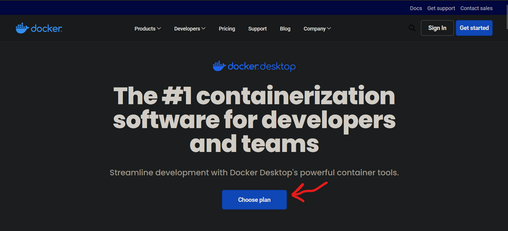

3. Chosse Docker Personal.
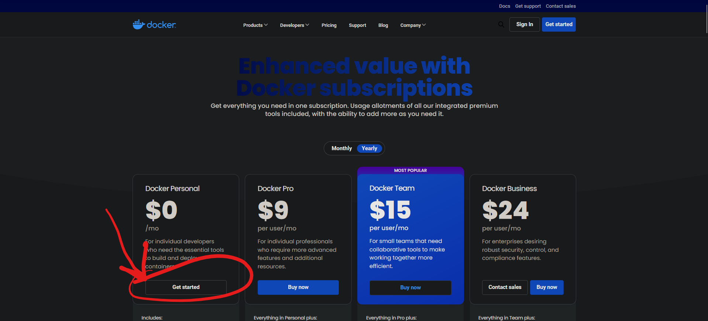

4. Press `Continue with GitHub`-button.

5. Sign in with your school-email and password.
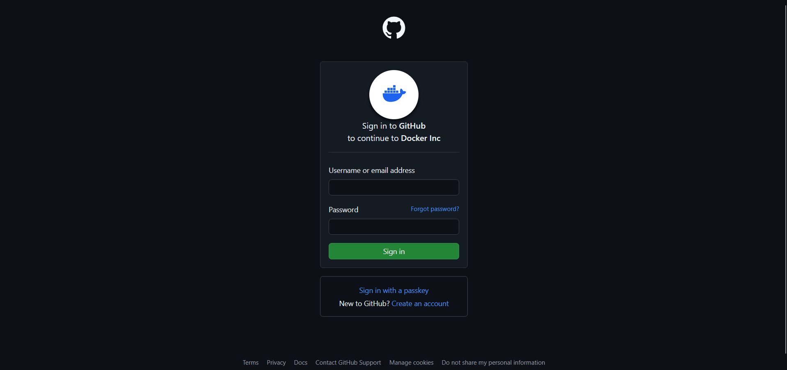

6. Now you are in Docker Home and press the `Go to download`-button. 
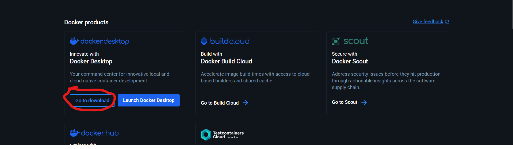

7. Select which operating software (OS) that you are using.
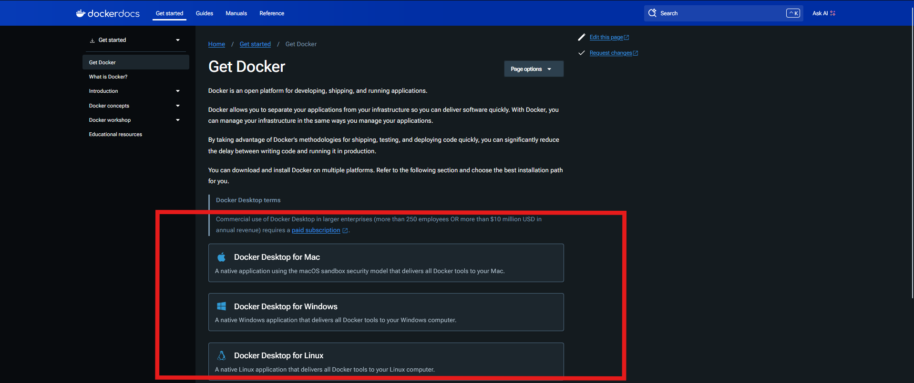

8. When you have selected OS and installed your OS, then open a Docker desktop program/app.

9. Congratulations, now you have installed the Docker desktop and sign in your GitHub account if account doesn't appear in Docker desktop! 
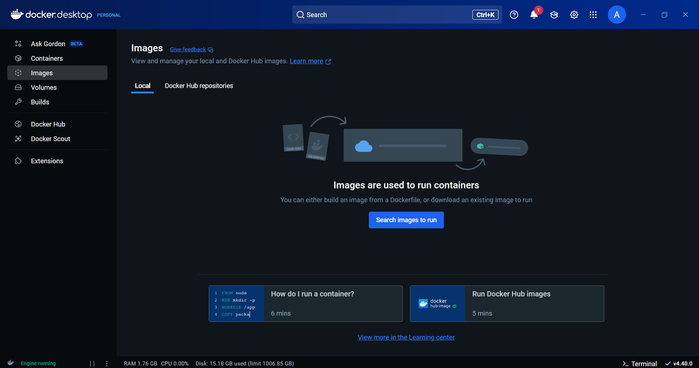

## Run containers in Docker
When you have installed your Docker desktop, then you can run Docker containers, but first you need to get LenaSYS repository.

1. Open your terminal which can be bash, powershell or command. You can also use vscode terminal. 

2. When you have open the terminal, then choose which folder you want to get LenaSYS repository. To do that you need to type `cd path/to/folder`. For me I using Windows and I typed: `cd  .\Downloads\` or if you use different OS then type: `cd <foldername>\`. 
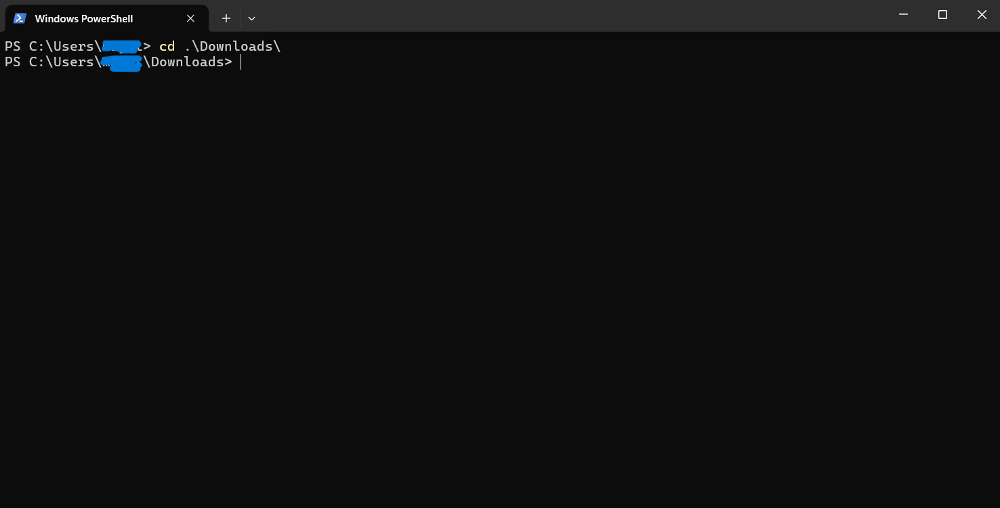

3. When you have chose a folder, then type this command: `git clone https://github.com/HGustavs/LenaSYS.git` and wait for finish to get LenaSYS repository.
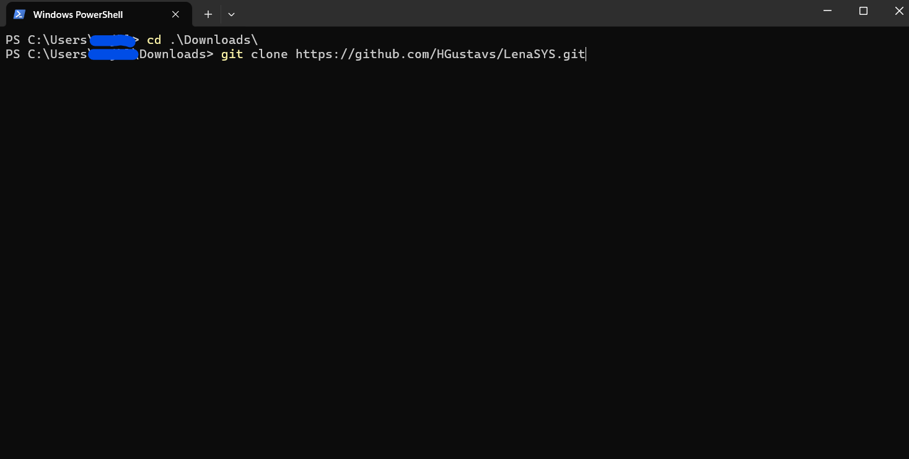

4. Now you have LenaSYS repository, so you need to change directory in the terminal and type: `cd LenaSYS/dockerenv/`.
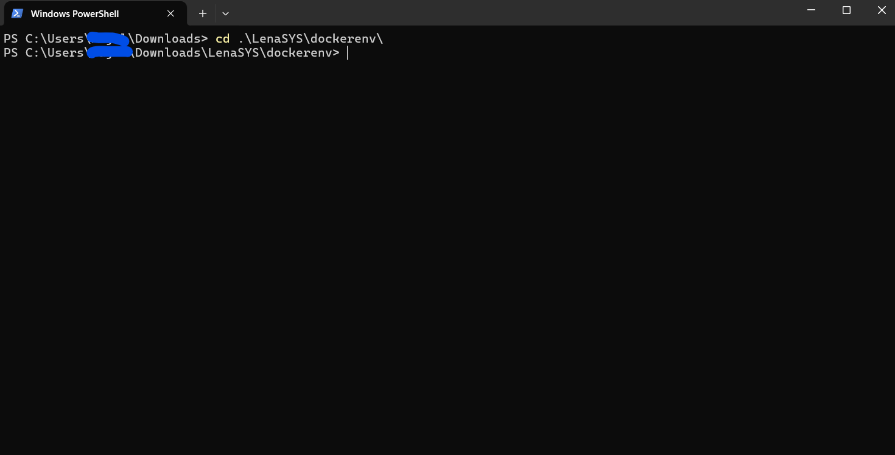

5. Here you need to build a few images and containers, and to do that run the command: `docker-compose up --build`. NOTE: You need to keep open Docker desktop program/app and do not turn off, otherwise this command will show an error and will not work.
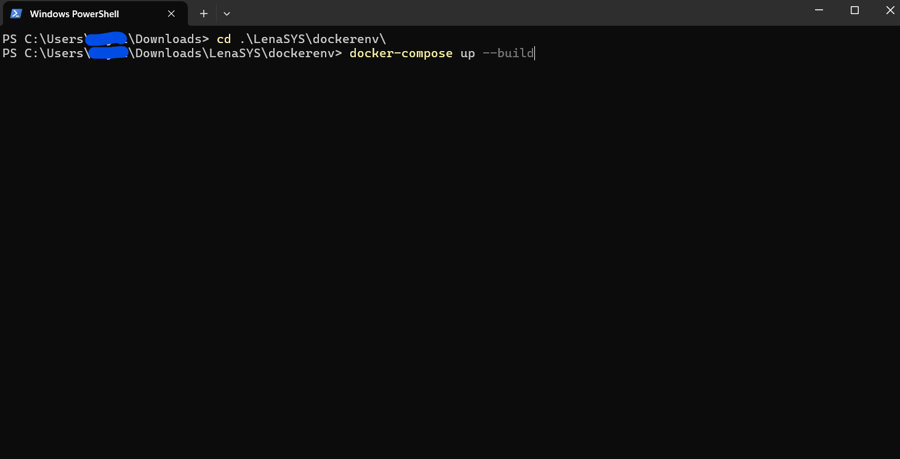

6. To know if Docker is finish to build images and containers when the terminal stop printing out or show blue apache-php name. NOTE: Do not close down the terminal while docker is running, otherwise containers will shutdown.
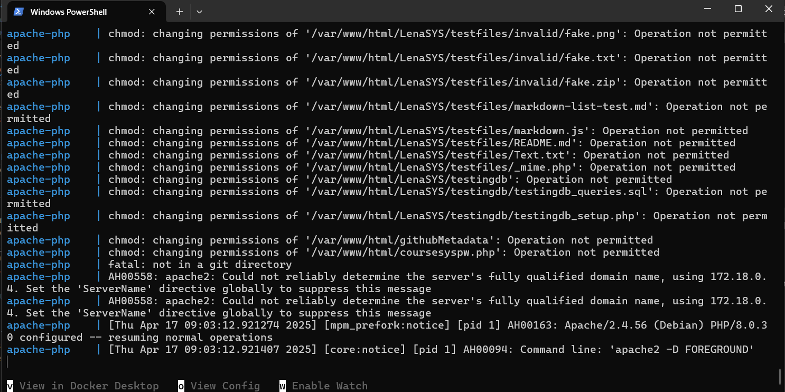

7. Now go to Docker desktop and you can see a menu which says images and containers. Press the containers from the menu and here you can see there are three containers and each one has green-circles which means they are running. If you can not see three containers, then you need to press `drop-down`-button
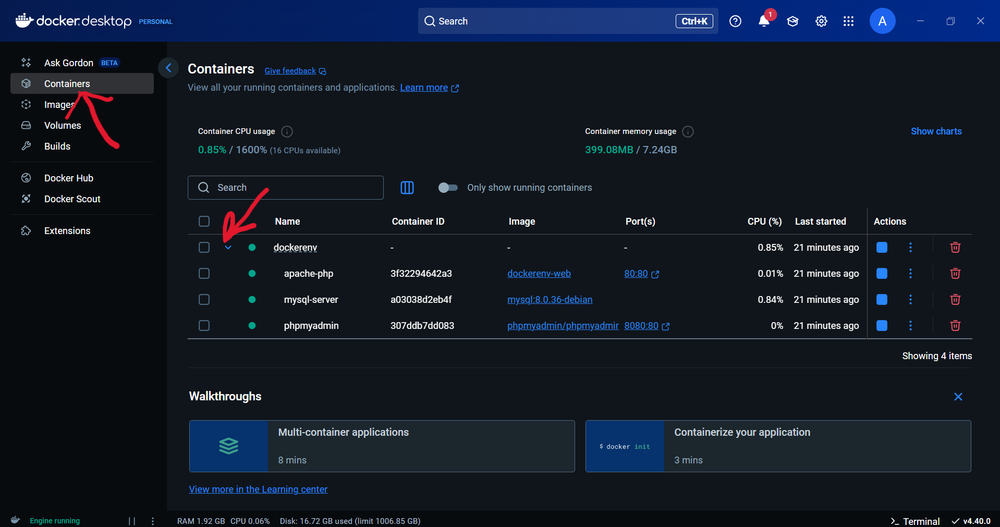

8. There are two ports which are apache-php and phpmyadmin server. The apache-php has a port `80:80` which can be click to open LenaSYS website. The phpmyadmin has also a port `8080:80` which open phpmyadmin website there you can manipulate sql-data, user permission and more. You need to press the `80:80` link to open the LenaSYS website.
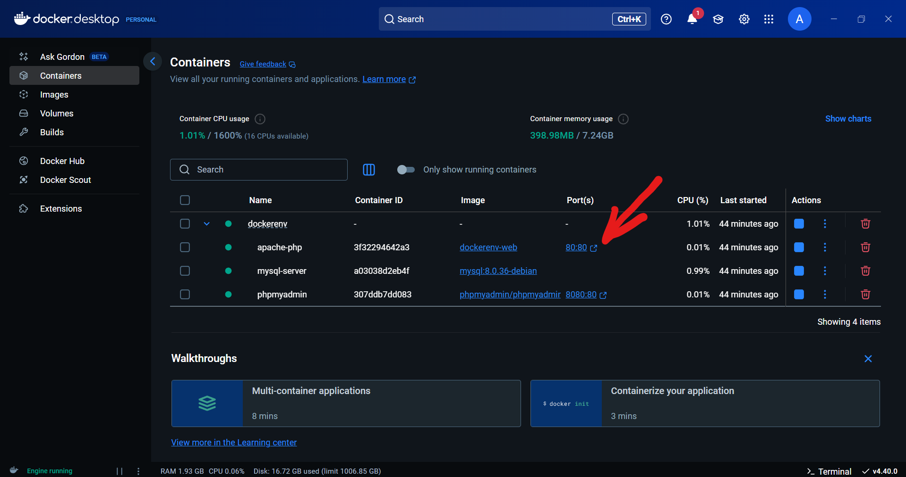

9. Now you are in directory and you need to navigate `LenaSYS/newinstaller/installer.php` to install the LenaSYS from a new LenaSYS installer. There is also old LenaSYS installer. If the new installer doesn't work, then navigate `LenaSYS/install/install.php` to access the old LenaSYS installer.
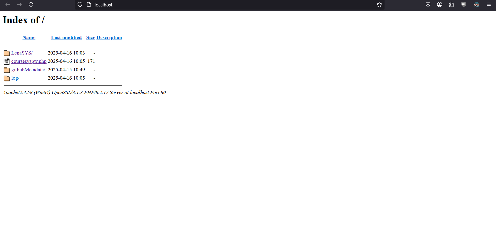

10. Congratulations, now you can use the LenaSYS website!
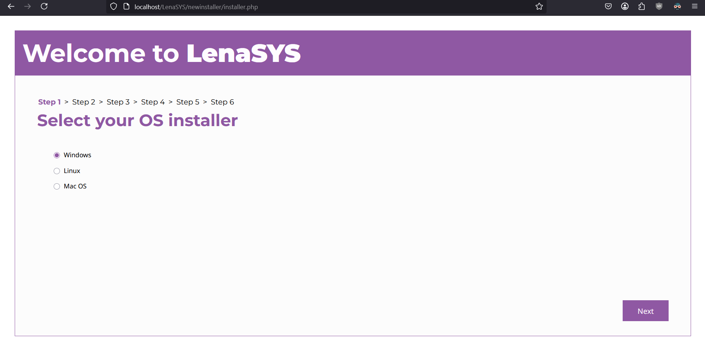 

11. Before you install the LenaSYS, it is good to know that if you see text-input says `Hostname`, then you need to type `db`, not `localhost` and you need check/turn on `Use Distributed Environment`-checkbox. Also when you are in root user credentials, then type in root user: `root` and root password: `password`, because all default values is set in docker-compose-yml.

12. To install the LenaSYS, you need to follow instruction [new LenaSYS installer](../../Shared/Documentation/newinstaller/documentation.md/#installer-steps) or [old LenaSYS installer](../../README.md).

## Stop containers in Docker

1. To stop running containers, open the terminal where docker is running press `ctrl-c` and wait all three containers says stopped. NOTE: If your terminal says all three are stopped, but not appear your username in your terminal, then press the up- or down-arrow keys to show your username.
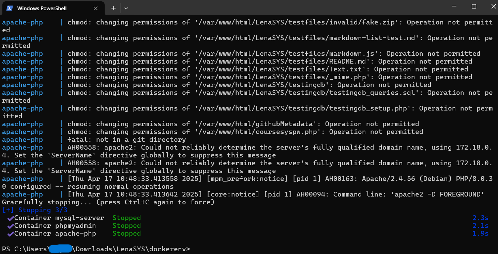 

2. If you go back to Docker desktop and go to containers, and here you can see three containers are not running, because there are no green-circles. Now containers are not running.
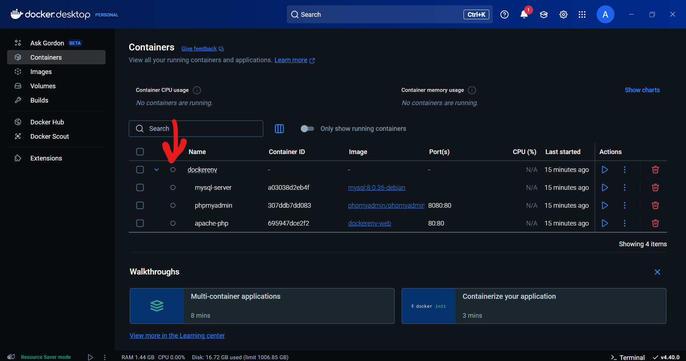 

## Remove containers in Docker

1. If you want remove all containers, then first stop running containers which you can follow this step [stop containers in Docker](#stop-containers-in-docker).

2. After that run the command: `docker-compose down` in the terminal.
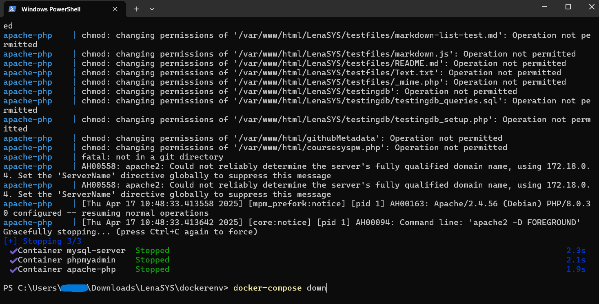

3. Now your terminal says removed which means containers are removed.
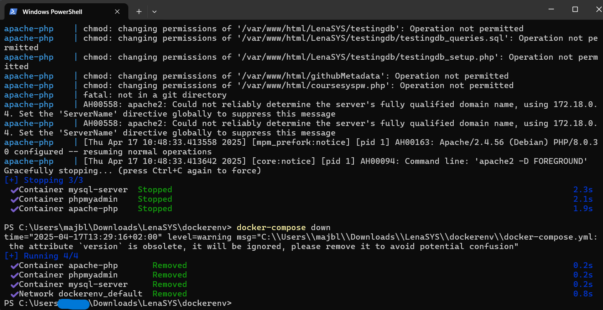 

4. You can check in Docker desktop and press containers. Here you can see that all containers are gone and now you have successful removed all containers.
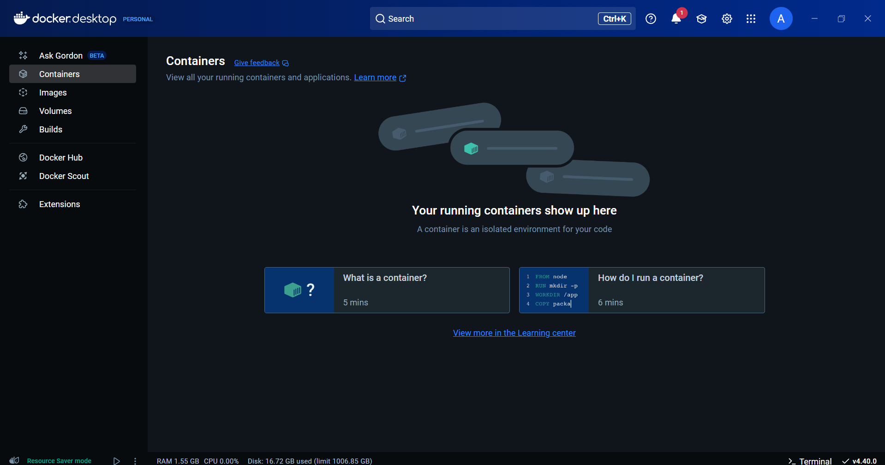

### Using linux or mac?
Make sure you set the appropriate file permissions for LenaSYS. The easiest way to do this is to run the command `sudo chmod -R 777 LenaSYS`.
After changing the file permissions recursively over the repository, all the files may show up as changes. To fix this, run `git config core.fileMode false` in the root of the repository.
